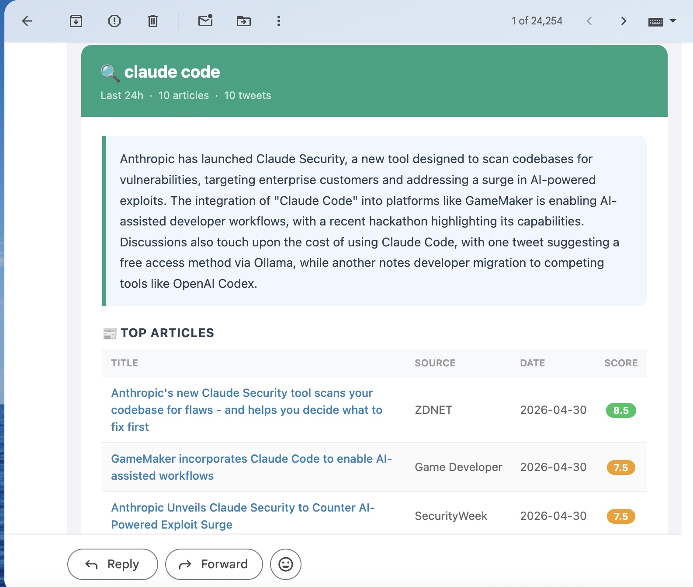
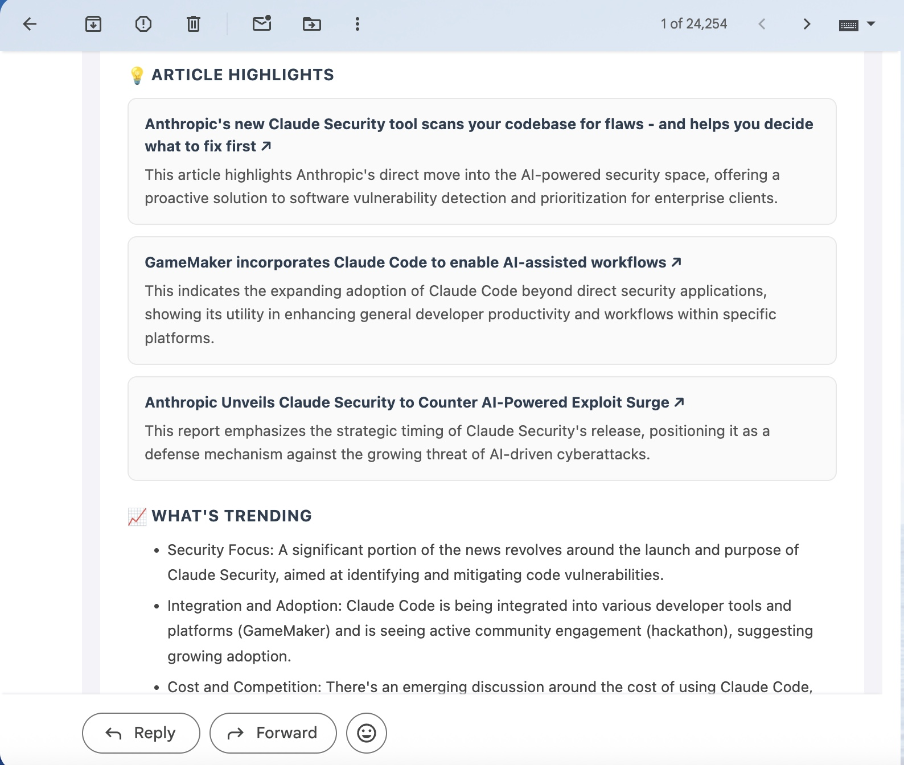
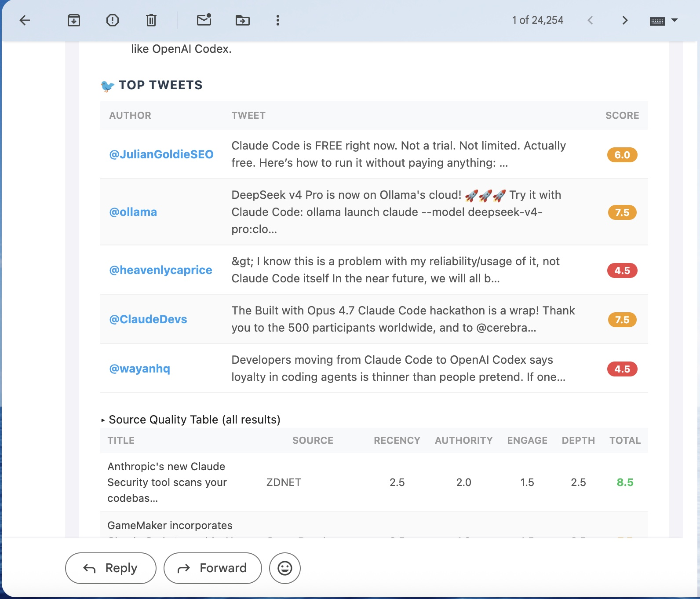

# 📡 Topic Monitor

A Claude Code skill that monitors trending news and tweets for any keyword, scores each source for quality, synthesizes an AI intelligence report using Gemini, and delivers it as a polished HTML digest email — automatically, every time your Mac wakes up.

  

---

## What it does

- **Searches** Google News RSS for any keyword — no scraping, no API key needed for web results
- **Optionally searches Twitter/X** (Latest + Top posts, English only, balanced feed)
- **Scores every source** on 4 dimensions: Recency, Authority, Engagement, Depth (max 10)
- **Synthesizes** an AI report per topic using Gemini: executive summary, article highlights, trending themes
- **Emails** a card-style HTML digest to any number of recipients
- **Runs automatically** on every Mac wake + every 12 hours via macOS launchd — no cloud subscription needed

### Two delivery modes

| Trigger | Destination | Format |
|---|---|---|
| Manual `/topic-monitor KEYWORD` | **Obsidian vault** | Full markdown note, one file per topic per day |
| Automatic (launchd every 12h) | **Gmail inbox** | Card-style HTML digest covering all active topics |

**Manual searches** save to your Obsidian vault automatically (if `obsidian_vault` is set in `config.md`):
```
Research/Topic Monitor/
├── openAI/
│   └── 2026-05-01.md
├── claude code/
│   └── 2026-05-01.md
└── adobe/
    └── 2026-05-01.md
```

See [examples/2026-05-01 buildinpublic.md](examples/2026-05-01%20buildinpublic.md) for a real example of what a manual Obsidian note looks like.

**Scheduled runs** send an email digest only — nothing is written to Obsidian. This keeps your vault clean while still delivering the daily summary to your inbox.

### Example email digest

Each topic gets its own card with:
- Executive Summary (AI-written, 3–4 sentences)
- 📰 Top Articles — clickable links, scored
- 💡 Article Highlights — top 3 with insight blurbs, linked to source
- 📈 What's Trending — dominant themes across all sources
- 🐦 Top Tweets — when Twitter is enabled for that topic
- ▸ Source Quality Table — collapsible, full breakdown





---

## Requirements

- macOS (uses launchd for scheduling)
- [Claude Code](https://claude.ai/code) CLI
- Python 3.10+
- A Gmail account + [App Password](https://myaccount.google.com/apppasswords)
- A [Gemini API key](https://aistudio.google.com/apikey) (free tier works — ~$0.001 per run)
- _(Optional)_ A [TwitterAPI.io](https://twitterapi.io) key ($1 free credit included)

---

## Installation

### 1. Clone into your Claude skills directory

```bash
git clone https://github.com/tiffanyiong/topic-monitor \
  ~/.claude/skills/topic-monitor
```

### 2. Install Python dependencies

```bash
pip3 install google-genai certifi
```

### 3. Configure your settings

```bash
cp ~/.claude/skills/topic-monitor/config.example.md \
   ~/.claude/skills/topic-monitor/config.md
```

Edit `config.md` and fill in your values:

```
obsidian_vault: /Users/YOUR_USERNAME/path/to/obsidian    # optional
email_recipients: you@gmail.com                          # comma-separated
schedule_timezone: America/Los_Angeles                   # your timezone
```

### 4. Save your Gemini API key

Get a free key at [aistudio.google.com/apikey](https://aistudio.google.com/apikey), then:

```bash
echo "YOUR_GEMINI_API_KEY" > ~/.claude/skills/topic-monitor/gemini_api_key
chmod 600 ~/.claude/skills/topic-monitor/gemini_api_key
```

### 5. Set up Gmail delivery

You need a Gmail [App Password](https://myaccount.google.com/apppasswords) (not your regular password).

**Step 1** — Enable 2-Step Verification at [myaccount.google.com/security](https://myaccount.google.com/security)

**Step 2** — Create an App Password:
1. Go to [myaccount.google.com/apppasswords](https://myaccount.google.com/apppasswords)
2. Select app: **Mail** → device: **Other** → name it `topic-monitor`
3. Click **Generate** and copy the 16-character password

**Step 3** — Run the setup wizard in Claude Code:
```
/topic-monitor setup email
```
This saves your credentials securely (chmod 600) and tests the connection.

### 6. Set up auto-scheduling (macOS launchd)

Edit the included plist to replace the Python path and username with yours:

```bash
# Find your Python path
which python3

# Edit the plist
nano ~/.claude/skills/topic-monitor/com.tiffany.topic-monitor.plist
# Replace: /Library/Frameworks/Python.framework/Versions/3.14/bin/python3
# Replace: /Users/tiffanyiong with /Users/YOUR_USERNAME

# Register with launchd
cp ~/.claude/skills/topic-monitor/com.tiffany.topic-monitor.plist \
   ~/Library/LaunchAgents/
launchctl load ~/Library/LaunchAgents/com.tiffany.topic-monitor.plist
```

The job will now run immediately on every Mac wake and every 12 hours while your Mac is on. If your Mac is off, it runs as soon as it wakes up.

### 7. Add your first topic and test

```
/topic-monitor follow openAI
/topic-monitor test run
/topic-monitor test email
```

---

## Usage

### One-off search (saves to Obsidian)
```
/topic-monitor openAI
/topic-monitor "bay area startups"
```

### Manage followed topics
```
/topic-monitor follow claude code
/topic-monitor unfollow xai
/topic-monitor pause adobe
/topic-monitor resume adobe
/topic-monitor list
```

### Manage recipients
```
/topic-monitor set recipients add friend@gmail.com
/topic-monitor set recipients remove friend@gmail.com
/topic-monitor set recipients you@gmail.com, colleague@gmail.com
```

### Twitter/X (optional)
```
/topic-monitor setup twitter
/topic-monitor set twitter openAI on     # enable per topic
/topic-monitor set twitter on            # enable for all topics
```

### Settings
```
/topic-monitor set window 48h            # change recency window
/topic-monitor set email you@gmail.com   # change primary recipient
```

### Testing & debugging
```
/topic-monitor test run                  # dry-run, no email sent
/topic-monitor test email                # send a test email
```

### Launchd management
```bash
# Trigger manually
launchctl start com.tiffany.topic-monitor

# Check status
launchctl list | grep topic-monitor

# View logs
tail -f ~/.claude/skills/topic-monitor/logs/daily.log
tail -f ~/.claude/skills/topic-monitor/logs/daily.error.log

# Pause auto-runs
launchctl unload ~/Library/LaunchAgents/com.tiffany.topic-monitor.plist

# Resume
launchctl load ~/Library/LaunchAgents/com.tiffany.topic-monitor.plist
```

---

## Source Scoring Rubric

Each source is scored across 4 dimensions (max 2.5 each = 10 total):

| Dimension | Criteria |
|---|---|
| **Recency** | ≤1 day = 2.5 · ≤7 days = 2.0 · ≤30 days = 1.5 · ≤6 months = 1.0 |
| **Authority** | Reuters/BBC/NYT/arXiv = 2.5 · TechCrunch/Wired = 2.0 · Other = 1.0 |
| **Engagement** | Google News inclusion = 1.5 · Twitter engagement scored 0.5–2.5 |
| **Depth** | ≥800 words = 2.5 · ≥400 = 2.0 · ≥100 = 1.5 · unknown = 1.0 |

**Score thresholds:** 8–10 = feature prominently · 6–7.5 = include · 4–5.5 = include with caveat · <4 = flag ⚠️

---

## File Structure

```
~/.claude/skills/topic-monitor/
├── SKILL.md                    # Claude skill definition
├── config.md                   # Your personal settings (gitignored)
├── config.example.md           # Template — copy to config.md
├── subscriptions.md            # Your followed topics
├── gemini_api_key              # Gemini key (gitignored, chmod 600)
├── gmail_app_password          # Gmail App Password (gitignored, chmod 600)
├── gmail_sender                # Gmail address (gitignored, chmod 600)
├── twitter_api_key             # TwitterAPI.io key (gitignored, chmod 600)
├── logs/                       # launchd run logs (gitignored)
├── scripts/
│   ├── run_daily.py            # launchd entry point — runs all subscriptions
│   ├── run_search.py           # Manual search entry point
│   ├── search.py               # Google News RSS fetcher + scorer
│   ├── twitter_search.py       # TwitterAPI.io fetcher + scorer
│   └── send_email.py           # Gmail SMTP sender + setup wizard
└── references/
    ├── output-format.md        # Obsidian note template
    ├── source-scoring.md       # Scoring rubric reference
    └── user-guide.md           # Full command reference
```

---

## Security

All credential files are `chmod 600` — readable only by your user account. They are also listed in `.gitignore` and will never be committed.

> **Never** put your API keys, Gmail App Password, or email address in any file that isn't gitignored.

---

## AI Synthesis

Uses **Gemini** with a model fallback chain (tries in order):
1. `gemini-3.1-flash-lite-preview`
2. `gemini-2.5-flash-lite`
3. `gemini-3-flash-preview`
4. `gemini-2.5-flash`

**Cost**: ~$0.001–$0.005 per daily run. Effectively free on the Gemini free tier.

---

## License

MIT

---

## Contributing

This skill started as a personal project, but if you find it useful, improvements are very welcome! Feel free to open an issue if something isn't working, suggest a new feature, or submit a pull request — whether it's a bug fix, a new search source, or a better email template. No contribution is too small.

If you run into any trouble setting it up, don't hesitate to open an issue and describe what went wrong. Happy to help!
